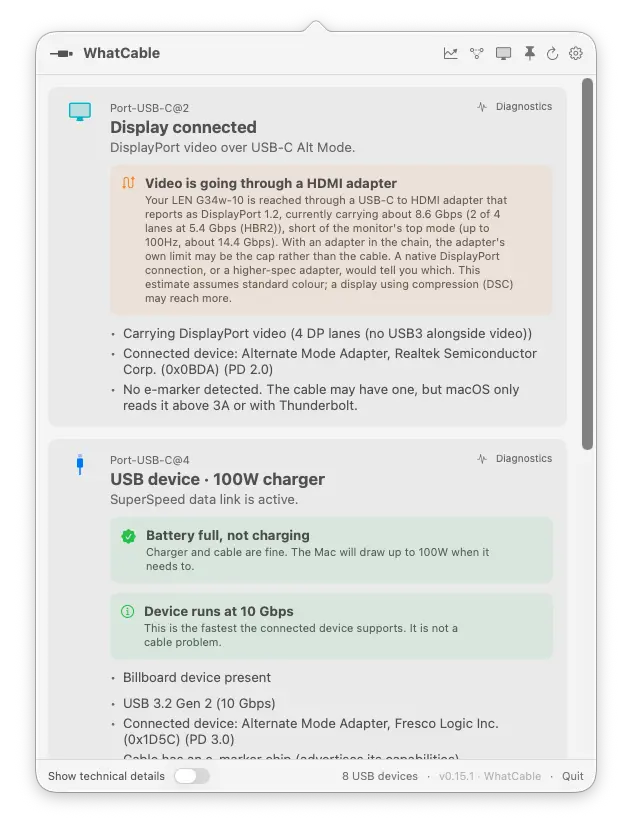

# WhatCable

> **What can this USB-C cable actually do?**

A small macOS menu bar app that tells you, in plain English, what each USB-C cable plugged into your Mac can actually do, and **why your Mac might be charging slowly**.

USB-C hides a lot under one connector. Anything from a USB 2.0 charge-only cable to a 240W / 40 Gbps Thunderbolt 4 cable, all looking identical in your drawer. macOS already exposes the relevant info via IOKit; WhatCable surfaces it as a friendly menu bar popover.

[](https://github.com/darrylmorley/whatcable/releases/latest)
[](https://github.com/darrylmorley/whatcable)
[](LICENSE)



> [!IMPORTANT]
> **Upgrading from 0.5.x to 0.6.0?** WhatCable's bundle ID changed from `com.bitmoor.whatcable` to `uk.whatcable.whatcable` in 0.6.0 to match the new `whatcable.uk` domain. The in-app "Check for Updates" path in 0.5.x will refuse to install 0.6.0 because the downloaded bundle ID won't match what it expects. Upgrade through Homebrew (`brew upgrade --cask whatcable`) or by downloading [the latest release zip](https://github.com/darrylmorley/whatcable/releases/latest) and replacing `WhatCable.app` manually. Your preferences and notification permissions will reset on first launch of 0.6.0; re-enable launch-at-login from Settings if you had it on. This only affects the 0.5.x → 0.6.0 transition.

## What it shows

Per port, in plain English:

- **At-a-glance headline:** Thunderbolt / USB4, USB device, Charging only, Slow USB / charge-only cable, Nothing connected
- **Charging diagnostic:** when something's plugged in, a banner identifies the bottleneck:
  - *"Cable is limiting charging speed"* (cable rated below the charger)
  - *"Charging at 30W (charger can do up to 96W)"* (Mac is asking for less, e.g. battery near full)
  - *"Charging well at 96W"* (everything matches)
- **Cable e-marker info:** the cable's actual speed (USB 2.0, 5 / 10 / 20 / 40 / 80 Gbps), current rating (3 A / 5 A up to 60W / 100W / 240W), and the chip's vendor
- **Cable trust signals:** an orange card appears when the e-marker reports values that look unusual against the USB-PD spec, like a zero vendor ID, a reserved bit pattern in the speed / current / cable-latency fields, or a VID that isn't in USB-IF's published list. Wording is hedged on purpose: a flag means "this looks unusual," not "this cable is fake."
- **Charger PDO list:** every voltage profile the charger advertises (5V / 9V / 12V / 15V / 20V…) with the currently negotiated profile highlighted in real time
- **Connected device identity:** vendor name and product type, decoded from the PD Discover Identity response
- **Attached USB devices:** storage, hubs, and peripherals listed under the physical port they're plugged into, with their negotiated speed
- **Active transports:** USB 2 / USB 3 / Thunderbolt / DisplayPort
- **⌥-click** the menu bar icon (or flip the toggle in Settings) to reveal the underlying IOKit properties for engineers

Click the **gear icon** in the popover header to open Settings, where you can:

- Hide empty ports
- Launch at login
- Run as a regular Dock app instead of a menu bar icon
- Get notifications when cables are connected or disconnected

Right-click the menu bar icon for **Refresh**, a **Keep window open** toggle (handy for screenshots and demos), **Check for Updates…**, **About**, **WhatCable on GitHub**, and **Quit**.

## Install

Visit [whatcable.uk](https://whatcable.uk) for an overview and screenshots, or install directly below.

Download the latest `WhatCable.zip` from the [Releases page](https://github.com/darrylmorley/whatcable/releases/latest), unzip, and drag `WhatCable.app` to `/Applications`.

The app is universal (Apple silicon + Intel), signed with a Developer ID, and notarised by Apple, so there are no Gatekeeper warnings.

Requires macOS 14 (Sonoma) or later. Apple Silicon only. On Intel Macs, the USB-C ports are driven by Intel Titan Ridge / JHL9580 Thunderbolt 3 controllers, and the USB-PD state and cable e-marker data WhatCable depends on are not exposed through any public IOKit accessor.

> **Note:** The manual install gives you the menu bar app only. The `whatcable` CLI is bundled inside the `.app` and is not on your PATH by default. If you want to use it from the shell, see the [Command-line interface](#command-line-interface) section below for the one-line symlink. Or install via Homebrew, which sets up the CLI automatically.

### Homebrew

```bash
brew tap darrylmorley/whatcable
brew install --cask whatcable
```

This installs the menu bar app and symlinks the `whatcable` CLI into your PATH.

## Command-line interface

A `whatcable` binary ships alongside the menu bar app, driven by the same diagnostic engine:

```bash
whatcable                # human-readable summary of every port
whatcable --json         # structured JSON, pipe into jq
whatcable --watch        # stream updates as cables come and go (Ctrl+C to exit)
whatcable --raw          # include underlying IOKit properties
whatcable --version
whatcable --help
```

If you installed the `.app` manually rather than via Homebrew, the CLI lives at `WhatCable.app/Contents/Helpers/whatcable`. Symlink it into your PATH if you want it on the shell:

```bash
ln -s /Applications/WhatCable.app/Contents/Helpers/whatcable /usr/local/bin/whatcable
```

The Homebrew install does this for you automatically.

## How it works

WhatCable reads four families of IOKit services. No entitlements, no private APIs, no helper daemons:

| Service | What it gives us |
| --- | --- |
| `AppleHPMInterfaceType10/11/12` (M3-era), `AppleTCControllerType10/11` (M1 / M2), and `IOPort` (M4 Mac mini front ports) | Per-port state: connection, transports, plug orientation, e-marker presence. `Type11` is what M2 MacBook Air uses for its MagSafe 3 port. |
| `IOPortFeaturePowerSource` | Full PDO list from the connected source, with the live "winning" PDO |
| `IOPortTransportComponentCCUSBPDSOP`, `...SOPp`, `...SOPpp` | PD Discover Identity VDOs from the port partner (SOP), the cable's near-end e-marker (SOP'), and the far-end e-marker (SOP'') if present |
| XHCI controller subtree | Each connected USB device is paired to its physical port via the XHCI port node's `UsbIOPort` registry path, falling back to a bus-index derived from the controller's `locationID` upper byte and the port's `hpm` SPMI ancestor on machines that don't expose `UsbIOPort`. |

Cable speed and power decoding follow the USB Power Delivery spec (aligned to USB-PD R3.2 V1.2, March 2026). Vendor names come from USB-IF's published vendor-ID list, bundled as a TSV refreshed by `scripts/update-vendor-db.sh`.

## Build from source

```bash
swift run WhatCable          # menu bar app
swift run whatcable-cli      # CLI
```

Requires Swift 5.9 (Xcode 15+).

## Build a distributable .app

```bash
./scripts/build-app.sh
```

Produces a universal `dist/WhatCable.app` (arm64 + x86_64) and `dist/WhatCable.zip`.

**Modes:**

| Configuration | Result |
| --- | --- |
| No `.env` | Ad-hoc signed. Works locally; Gatekeeper warns on other Macs. |
| `.env` with `DEVELOPER_ID` | Developer ID signed + hardened runtime. |
| `.env` with `DEVELOPER_ID` + `NOTARY_PROFILE` | Full notarisation + stapled ticket. Gatekeeper-clean for everyone. |

**Cutting a release:**

```bash
# write release-notes/v0.5.3.md first, then:
./scripts/release.sh 0.5.3
```

The wrapper does the whole pipeline: bumps the version, runs build-app.sh
(which builds, signs, notarises, smoke-tests, and bumps the local cask),
tags and pushes the commit, creates the GitHub release with the notes
file, verifies the uploaded asset's sha matches the local zip, copies the
notes into the tap, and pushes the tap. Use `--dry-run` first to validate
state. Requires `gh` (auth'd) and the env vars from `.env.example`.

**One-time setup for full notarisation:**

```bash
# 1. Find your signing identity
security find-identity -v -p codesigning

# 2. Store notarytool credentials in the keychain
xcrun notarytool store-credentials "WhatCable-notary" \
    --apple-id "you@example.com" \
    --team-id "ABCDE12345" \
    --password "<app-specific-password>"   # generate at appleid.apple.com

# 3. Create your .env from the template
cp .env.example .env
# ...and fill in DEVELOPER_ID
```

## Caveats

- **Cable e-marker info only appears for cables that carry one.** Most USB-C cables under 60 W are unmarked. Any Thunderbolt / USB4 cable, any 5 A / 100 W+ cable, and most quality data cables will be e-marked.
- **Some cables only reveal their e-marker once something is plugged in at the other end.** The chip in the cable's plug runs off VCONN (a small power rail your Mac feeds into the cable) and only answers when the host issues a "Discover Identity" message. With nothing attached, some Macs read the e-marker straight away, others wait until they see a real partner to negotiate with. If a cable shows up as basic when bare, plug a charger, dock, or device into the far end and check again.
- **WhatCable trusts the e-marker for capabilities.** Cable speed, current rating, and vendor come straight from the chip in the cable's plug, and software cannot verify what's inside the jacket. If a cable claims 240W / 40 Gbps but performs poorly, the chip is lying, not WhatCable. The trust-signals card flags a small set of internal-consistency tells (zero VID, reserved bit patterns in the Cable VDO, a VID not in the USB-IF list) that often appear on counterfeit or mis-flashed cables, but those flags are hedged signals, not proof.
- **PD spec coverage:** the decoder is aligned to USB-PD R3.2 V1.2 (March 2026). Earlier 3.0 / 3.1 cables work fine.
- **Vendor name lookup uses USB-IF's published list** (~13,650 entries, March 2026 snapshot). VIDs assigned by USB-IF after that snapshot will show as "Unregistered / unknown" and trip a trust-signal flag until the bundled list is refreshed.
- **macOS only.** iOS sandboxing makes USB-C e-marker access much harder.
- **Apple Silicon only.** Intel Macs route USB-C through Intel Thunderbolt 3 controllers (Titan Ridge / JHL9580). Apple's IOKit driver for those chips does not expose the USB-PD negotiation state or the cable e-marker VDOs, so there's no path to surface the same information on Intel hardware.
- **Not on the App Store.** App Sandbox blocks the IOKit reads we depend on.

## Privacy

WhatCable reads USB-C port state directly from IOKit on your Mac. All of that happens locally. Nothing is sent anywhere automatically.

**Cable reports:** If you use the "Report this cable" button on an e-marked cable, WhatCable builds a pre-filled GitHub issue containing the cable's vendor ID, product ID, and capability flags (VDOs). Your browser opens with that data in the issue form. Nothing is submitted until you click the button in GitHub yourself. Once submitted, the issue is public.

**Update checks:** WhatCable periodically checks the GitHub Releases API to see if a newer version is available. No personal data or hardware info is included in that request.

## Contributing

Issues and PRs welcome. The code is small and tries to stay readable. Start at [`Sources/WhatCable/ContentView.swift`](Sources/WhatCable/ContentView.swift) for the UI, [`Sources/WhatCableCore/PortSummary.swift`](Sources/WhatCableCore/PortSummary.swift) for the plain-English logic, or [`Sources/WhatCableCore/PDVDO.swift`](Sources/WhatCableCore/PDVDO.swift) for the bit-twiddling. Cross-platform models and the diagnostic engine live in `WhatCableCore`; the IOKit watchers (port state, PD identity, power sources, USB devices) live in [`Sources/WhatCableDarwinBackend/`](Sources/WhatCableDarwinBackend/). The same `WhatCableCore` powers the menu bar app and the `whatcable` CLI in [`Sources/WhatCableCLI/`](Sources/WhatCableCLI/).

## Credits

Built by [Darryl Morley](https://github.com/darrylmorley).

Inspired by every time someone has asked "*is this cable any good?*".
